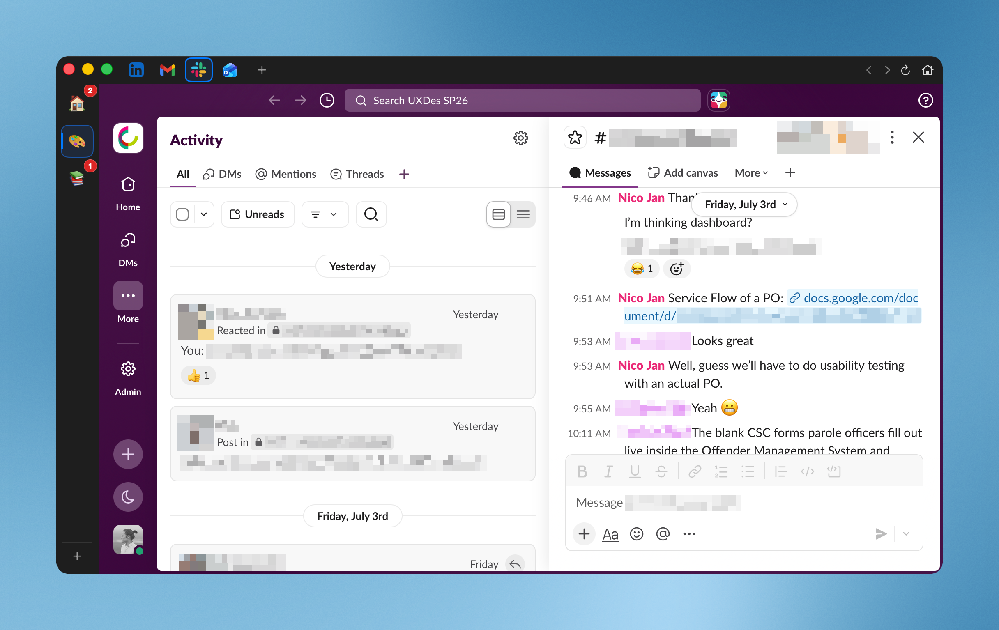

# Chorus

A native macOS app that unifies your web services (Gmail, Slack, Discord,
Notion, ChatGPT, and more) into one window, each with its own fully isolated
session. A lightweight, WebKit-based alternative to Chromium apps like Rambox
and Franz, built for Apple Silicon.

**[Download the latest release](https://github.com/nicojan/Chorus/releases/latest)** (macOS 14 or later). The build is signed, notarized, and updates itself via Sparkle.

> Status: 1.5.2 is the current release. See [CHANGELOG.md](CHANGELOG.md) for
> what changed.



## Features

- **Isolated sessions per service.** Each service gets its own
  `WKWebsiteDataStore`, so you can stay signed into two Gmail accounts (or a
  personal and work Slack) side by side with no cookie leakage.
- **Spaces.** Group services into spaces (e.g. 🏠 Personal, 💼 Work). A service
  can live in more than one space; sessions stay isolated per instance.
- **Badges & notifications.** Unread counts surface on the dock and per-space
  chips via title/DOM polling and intercepted web `Notification`s, and appear
  immediately on launch and after sign-in. Per-service control over badges and
  macOS notifications, per-service and per-space mute, plus global Do Not Disturb.
- **Memory-aware hibernation.** Least-recently-used services hibernate to
  reclaim memory and wake instantly where you left off; pin "Keep loaded"
  services that should never sleep.
- **Quick switcher** (`⌘K`), **find in page** (`⌘F`), **zoom** (`⌘+`/`⌘-`/`⌘0`),
  reload (`⌘R`), and drag-to-reorder services and spaces.
- **Smart link routing.** Cross-service links open in a matching Chorus service
  when one exists, otherwise in your default browser.
- **Ad & tracker blocking.** Blocks known ad and tracking domains across your
  services with the HaGezi blocklist, on by default. It won't remove ads a site
  serves from its own domain, like YouTube.
- **Resilient.** Pauses polling when offline or asleep, recovers from WebContent
  crashes with backoff, and never deletes your data without consent.

## How Chorus compares

Chorus, Rambox, and Franz all put your web apps in one window. They differ in how
they are built and what they cost. Rambox and Franz are Electron apps that bundle
Chromium and run on Windows and Linux as well as macOS, and both charge for the
full feature set. Franz's free tier stops at three services and one workspace.
Chorus is a native macOS app. It uses the system's own WebKit instead of shipping
a browser inside itself, so it stays lighter on memory, and every feature is free
with the source open under the MIT license.

| Feature | Chorus | Rambox | Franz |
|---------|--------|--------|-------|
| Price | Free, every feature | Freemium | Freemium; free tier caps at 3 services |
| Open source | Yes (MIT) | No | No |
| Engine | Native WebKit | Electron | Electron |
| Platforms | macOS 14+ | Windows, macOS, Linux | Windows, macOS, Linux |
| Preset services | ~50, plus any URL | 700+ | 70+ |
| Isolated session per service | Yes | Yes | Yes |
| Spaces / workspaces | Unlimited | Yes | Free tier: 1 |
| Custom CSS per service | Yes, with presets | Yes | No |
| Dark mode for any service | Yes | Yes | No |
| Quiet-hours Do Not Disturb | Yes | Yes | No |
| App lock | Touch ID | Password | No |
| Cross-device sync | No | Yes | Yes |

Chorus makes two trades for staying native and free. It runs only on macOS, and
it ships with about fifty preset services where Rambox lists several hundred,
though you can add any site by its URL. It also keeps your data on your Mac rather
than syncing across devices.

## Requirements

- macOS 14 (Sonoma) or later
- Xcode 16+ / Swift 6
- [XcodeGen](https://github.com/yonsm/XcodeGen) (`brew install xcodegen`). The
  Xcode project is generated from `project.yml`.

## Build & run

```sh
# Regenerate the Xcode project after changing project.yml or adding files
xcodegen generate

# Build and run the test suite from the CLI
xcodebuild test -project Chorus.xcodeproj -scheme Chorus -destination 'platform=macOS'
```

Or open `Chorus.xcodeproj` in Xcode and run the **Chorus** scheme.

## Project layout

| Path | What |
|------|------|
| `Chorus/App/` | App entry point and `AppState` (central coordinator) |
| `Chorus/Models/` | SwiftData models: `ServiceInstance`, `Space`, `SpaceServiceLink`, `AppPreferences` |
| `Chorus/Services/` | Badges, notifications, polling, data stores, catalog, networking |
| `Chorus/Views/` | SwiftUI views: main window, sidebar, web view pool, settings, sheets |
| `Chorus/Resources/` | Service catalog JSON and assets |
| `ChorusTests/` | Unit tests (pure logic: badges, validation, parsing, reordering, …) |

Architecture details live in [docs/internal/chorus-architecture-v2.md](docs/internal/chorus-architecture-v2.md).

## Notes

- The app icon is a generated placeholder; replace the images in
  `Chorus/Resources/Assets.xcassets/AppIcon.appiconset/` with custom artwork.
- Shipping to the Mac App Store additionally requires code signing, a
  provisioning profile, and notarization. Those are outside the scope of this
  repo.

## Contributing

Bug reports and pull requests are welcome. See [CONTRIBUTING.md](CONTRIBUTING.md)
to get set up.

## License

Chorus is available under the MIT License. See [LICENSE](LICENSE).
